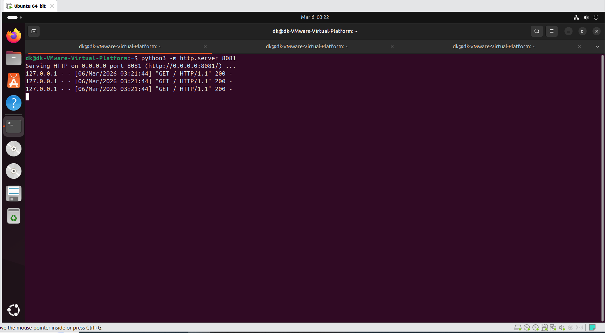
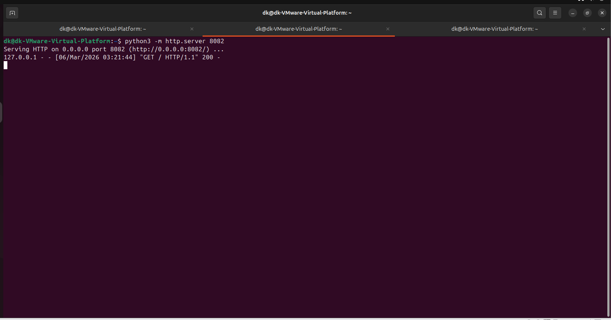
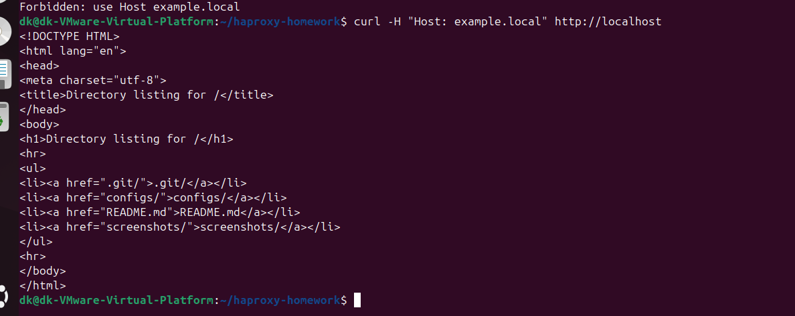
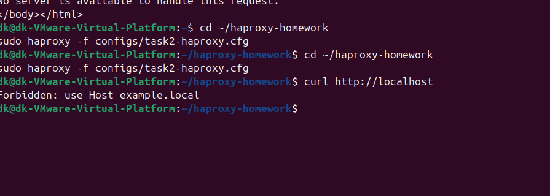
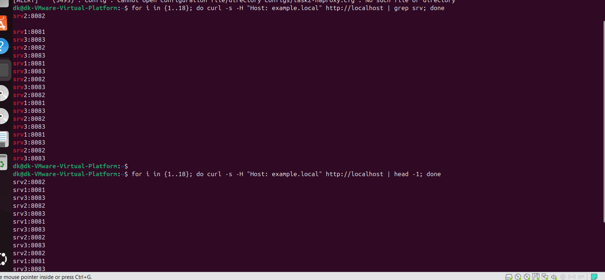

# HAProxy Homework

## Конфигурационные файлы

Task 1
[Конфигурационный файл](configs/task1-haproxy.cfg)

Task 2
[Конфигурационный файл](configs/task2-haproxy.cfg)


## Задание 1 (L4 Round-robin)

### Запуск двух simple python server
```bash
sudo mkdir -p /opt/srv1 /opt/srv2
echo "srv1:8081" | sudo tee /opt/srv1/index.html
echo "srv2:8082" | sudo tee /opt/srv2/index.html

# в разных терминалах:
python3 -m http.server 8081 --directory /opt/srv1
python3 -m http.server 8082 --directory /opt/srv2
```





## Задание 2 — Weighted Round Robin (L7) только для example.local

Запущены 3 сервера:
- srv1:8081
- srv2:8082
- srv3:8083

HAProxy балансирует HTTP-трафик только при обращении к домену `example.local`.
Без домена возвращает 403.

### Проверка с доменом
```bash
for i in {1..18}; do
  curl -s --http1.1 -H "Connection: close" http://example.local/
done
```
Запрос без Host header (403):



Запрос с Host example.local:



task2_balancing.png
